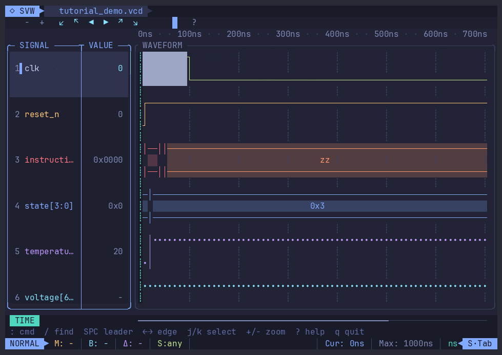

<p align="right">
  <a href="./README.md">English</a> | <a href="./README.zh-CN.md">中文</a>
</p>

# svw — Simple Virtual Wave

**svw** 为人类、自动化任务和 AI agent 提供快速、专注的终端波形调试体验。

打开仿真波形后，可以在本机终端、SSH、CI 容器或编辑器旁使用同一套专注的
终端调试工作流。

<p align="center">
  
</p>

## svw 是什么？

svw 无需额外设置即可打开 VCD、EVCD 和 FST 波形,并在终端中清晰呈现数字
信号、总线、未知状态和实数轨迹。gzip 压缩的 VCD/EVCD 文件(`.vcd.gz`)
可直接透明打开。

交互界面提供模糊信号选择器、marker、边沿导航、缩放历史、鼠标操作、主题、
`:` 命令行和 `Space` leader 菜单。颜色与字符会根据终端能力自动适配。

## 为什么选择 svw？

- **纯终端：** 在本机 shell、SSH 会话和容器中使用同一套专注的调试体验。
- **Vim 风格工作流：** 支持模式快捷键、`:` 命令、模糊搜索和可发现的
  leader 菜单。
- **自动化优先：** 同一套工作流可通过脚本或聚焦的 JSON/TUI 查询重复执行。
- **比较与分析：** 在统一物理时间轴上比较波形，并在终端中查看报表、断言、
  transaction 和覆盖率。

## 安装

安装脚本支持通过 Homebrew 安装 **macOS（Apple silicon）** 版本，以及通过校验后的
GitHub Release 归档安装 **Linux（x86_64）** 版本。运行下面的命令安装最新版本：

```sh
curl --proto '=https' --tlsv1.2 -LsSf https://raw.githubusercontent.com/svcomplex-dev/svw/main/install.sh | sh
```

无参数命令始终跟随最新的不可变 Release，当前为 `0.1.0`；macOS 会安装
`svcomplex-dev/tap/svw`。两个平台都可以向同一安装器传入版本号，选择不可变的发布版本：

```sh
curl --proto '=https' --tlsv1.2 -LsSf https://raw.githubusercontent.com/svcomplex-dev/svw/main/install.sh | sh -s -- --version 0.1.0
```

如需显式安装可替换的滚动构建，请传入 `--version latest`。

打开波形：

```sh
svw wave.vcd
svw wave.fst
```

### 由用户激活的 FSDB bridge

svw 分发归档既不包含 reader SDK，也不包含 bridge 动态库；`bin/svw` 不与二者
直接链接。已有相应本机 reader 合法使用权的用户，可以自行构建单独采用 MIT
协议的 SVW Wave Bridge，并显式激活该本机动态库：

```sh
export SVW_FSDB_BRIDGE=/absolute/path/to/libsvw-wave-bridge.so
svw wave.fsdb
```

bridge 客户端及相关命令始终包含在 svw 中，不再存在 FSDB 专用编译开关。
`SVW_FSDB_BRIDGE` 只负责激活用户明确选择的本机动态库；未设置时，打开 FSDB
会给出激活说明，其他内置波形和设计工作流仍全部可用。

svw 不会搜索 bridge 或 reader 动态库。主进程建立有界只读通道，并启动同一份
精确 `svw` 可执行文件作为隔离子进程；只有该子进程以局部符号可见性加载用户
指定的 bridge 绝对路径，并解析唯一的版本化 C ABI 入口。bridge 再使用该用户
机器上安装的 reader。分发门禁会拒绝 bridge/reader 直接依赖、reader 符号与
路径、运行时搜索路径，以及混入 svw 制品的任何动态库或静态归档。

为获得最清晰的显示效果，建议使用字符覆盖完整的现代等宽终端字体。项目截图与
录屏采用相同的推荐设置。

## 常用命令

在 TUI 中按 `:`，输入命令后按 Enter。下面这些命令可以覆盖一次常见的初步
调试流程：

| 命令 | 用途 |
| --- | --- |
| `:open wave.fst` | 打开另一个波形文件。 |
| `:add top.cpu.clk` | 按完整层次名添加信号。 |
| `:add top.cpu.*` | 添加符合 `*` glob 的信号。 |
| `:addall top.cpu` | 添加某个 scope 下的全部信号。 |
| `:find 'clk\|reset'` | 使用 POSIX 正则搜索信号名。 |
| `:goto 100ns` | 将光标和视图移动到指定时刻。 |
| `:mark 100ns` / `:bmark 150ns` | 放置主 marker 和基准 marker。 |
| `:zoom fit` | 将视图适配到两个 marker 之间。 |
| `:save debug.svw` | 保存当前会话。 |
| `:source debug.svw` | 恢复已保存的会话，或运行命令脚本。 |
| `:help add` | 查看某条命令的用法；`:help` 打开完整帮助页。 |

Headless 模式可以在 CI 或 shell 管道中执行相同的 `:` 命令；命令文件中的
开头冒号可以省略：

```sh
printf 'add top.cpu.*\nmark 100ns\nmarks\nq\n' |
  svw --headless wave.vcd

svw --headless --session debug.svw < checks.svwcmd
```

svw 还提供非交互式波形工具：

```sh
# 比较全部同名信号；退出码 0 表示相同，1 表示存在差异
svw diff golden.vcd dut.vcd
```

全文件报告默认只显示存在差异的信号；需要为每个已比较信号输出完整段落时使用
`--all`。

## 性能

VCD 是纯文本:全量 eager 解析的内存开销是文件大小的数倍,因此打开
超过 100 MB 的 VCD 时 svw 会先自动流式转换为临时 KBX(内存有界、
惰性查询;`SVW_VCD_EAGER=1` 可强制旧的 eager 解析)。对于大文件或
需要反复打开的波形,建议先转换为 KBX 容器(KBX 即"快波形",是 svw
自有的压缩波形格式)——打开变成 mmap 映射,查询走磁盘索引:

```sh
svw extract wave.vcd wave.kbx
```

### 格式对比

以下数据由 `tests/mxv_bench` 实测(100000 个信号 × 2000 个时间步
= 2 亿次取值变更,noisy profile;AMD Ryzen 7 5800U,Linux x86_64——
绝对数值随机器不同):

| 指标 | VCD | FST | KBX | KBX(lazy) |
|---|---|---|---|---|
| 文件大小 (MB) | 487 | 116 | **98** | - |
| 写入 (s) | 10.5 | 20.9 | **21.8** | - |
| 加载 (s) | 80.7 | 39.0 | 11.9 | 见下注 |
| value_at (ns/op) | 1299 | 1299 | 1299 | 14874 |
| signal search (ns/op) | 2181514 | 2181514 | - | **960** |
| changes_in window (us/op) | 3.0 | 3.0 | 3.0 | 19.1 |

全量加载的格式共用同一套内存查询引擎,因此 `value_at`/`changes_in`
数字一致。lazy 列没有"加载"一说:lazy 打开 KBX 只是 mmap 加头部校验
(微秒级,与文件大小无关——低于 bench 的 0.1ms 分辨率,这也是旧版
表格印出误导性 "0.0000 s" 的原因),此后每次查询支付磁盘块解码开销
(见各 per-op 列)。

### 大 VCD 打开实测

真实 1.1 GB VCD(9300 万次取值变更,`svw --headless`,
`/usr/bin/time` 峰值 RSS,同一台机器):

| 打开路径 | 耗时 | 峰值内存 |
|---|---|---|
| eager 解析(旧路径) | 119 s | 34 GB |
| 流式自动转换(>100 MB 默认) | 68 s | **59 MB** |

`svw extract` 使用同一套流式 writer,转换本身内存同样有界
(89 MB VCD:峰值 60 MB,旧 eager 路径为 2.8 GB)。

## 不只为人类，也为 Agent

AI agent 可以检查波形上下文，并返回范围明确的 JSON 或可视化 TUI 证据，方便
人类直接复核：

<p align="center">
  
</p>

```sh
svw agent wave.fst info
svw agent wave.fst signals clk 10
svw agent wave.fst render 0 200 top.clk top.state --color ansi --view wave
```

对于长连接集成，`svw mcp [waveform]` 会启动严格 schema 的 MCP stdio server，
`svw rpc [waveform]` 会启动 JSON-RPC 2.0 stdio server。安装包同时包含 agent
集成示例与 svw waveform skill。

## 文档

完整命令参考、教程、键盘与鼠标操作、波形工具、设计调试、报表、覆盖率和
agent 集成，请访问 **[svw.run/docs](https://svw.run/docs)**。
